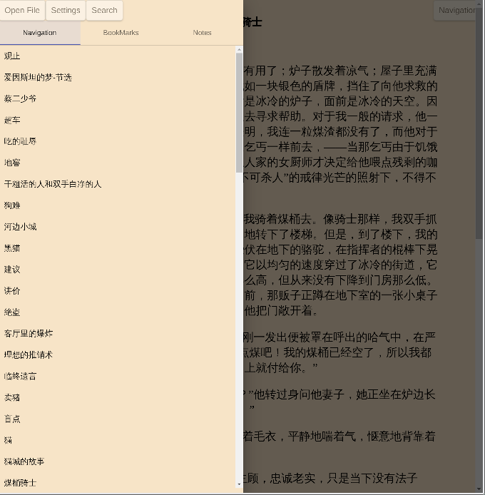

# ReaderBookAngular

If you have question , please request issue.

Press "m" on keyboard for open menu. 

## Preview

[Online Preview go to](https://ztftrue.github.io/BookReader/)





## Development server

Run `ng serve` for a dev server. Navigate to `http://localhost:4200/`. The app will automatically reload if you change any of the source files.

## Build

Run `ng build` to build the project. The build artifacts will be stored in the `dist/` directory. Use the `--prod` flag for a production build.

## Deploy to GitHub pages

```sh
ng build --prod --output-path docs --base-href /BookReader/
```

When the build is complete, make a copy of docs/index.html and name it docs/404.html.

Commit your changes and push.

On the GitHub project page, configure it to publish from the docs folder.

## Based of  [epub.js](https://github.com/futurepress/epub.js)
